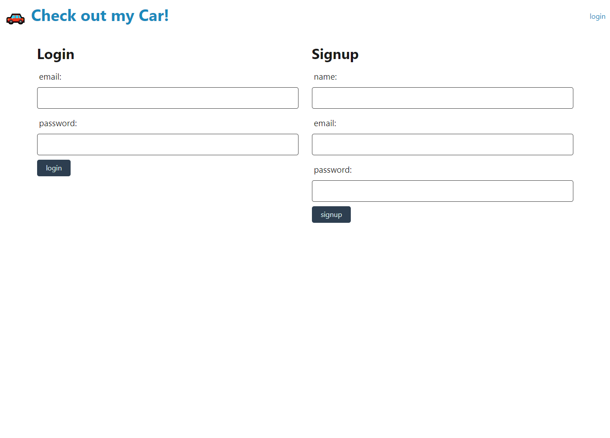

# Car-moot

```
    Full stack app
```

## Description
The plan for this app was to create a full stack application that would allow uses to upload, share and chat about car details with others users. This app had the intention to first be a small landing page for a user to upload information about their own car and cars they wanted. After that the plan was to add socket.io to allows users to chat and with consideration towards sharing a users saved "cars" through the chat window. As for now the landing page is complete but other features may come with further development.


## Planned Technologies
1. [Socket.io](https://socket.io/)
2. [axios](https://www.npmjs.com/package/axios)


## Screenshot



## Link
[Click here](https://powerful-sierra-85217.herokuapp.com/)


## Developed by:
```
John Foxwell
```


